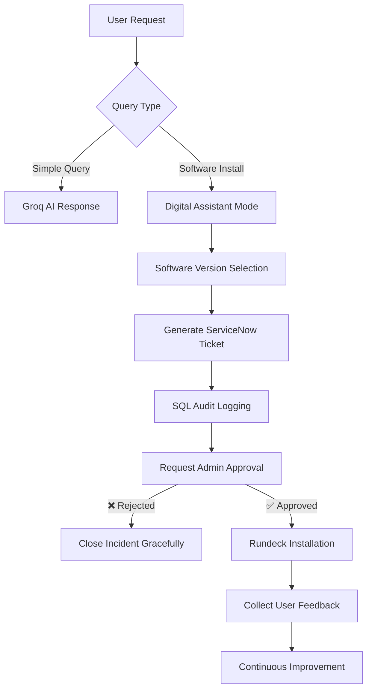

# 🌟 ITOPS Smart MCP Installer Bot

<div align="center">


**AI + ITSM + Automation in One Seamless Workflow**

*An intelligent chatbot that transforms software installation requests into end-to-end automated processes*

---

</div>

## 🚀 Project Overview

Welcome to the **ITOPS Smart MCP Installer Bot** — a revolutionary solution that combines cutting-edge AI with enterprise-grade ITSM and automation. This intelligent assistant doesn't just answer questions; it orchestrates complete software installation workflows from request to deployment.

### ✨ What Makes It Special

Our Smart Chatbot powered by advanced LLMs creates a seamless bridge between users and IT operations, transforming complex software installation processes into simple conversational experiences.

---

## 🎯 How It Works

### 🔹 **Simple Queries Mode**
For straightforward questions, the chatbot leverages the **Groq model (Gemma2-9b-it)** to provide instant, intelligent responses with natural language understanding.

### 🔹 **Software Installation Workflow**
When users request software installation, the bot becomes a comprehensive digital assistant:



#### **Step-by-Step Process:**

1. **🎯 Smart Software Selection**
   - Helps users choose the optimal software version
   - Provides compatibility recommendations
   - Validates system requirements

2. **📋 Automated Ticket Generation**
   - Creates incident tickets in ServiceNow via MCP integration
   - Includes all relevant details and user preferences
   - Maintains proper categorization and priority

3. **📊 Comprehensive Logging**
   - Logs every interaction in SQL database
   - Provides complete audit trail
   - Enables compliance and tracking

4. **⚖️ Admin Approval Workflow**
   - Routes requests to appropriate administrators
   - Handles approval/rejection logic seamlessly
   - Maintains security and governance standards

5. **🔄 Automated Execution**
   - **🔴 If Rejected:** Gracefully closes incident with user notification
   - **🟢 If Approved:** Rundeck executes automated installation process

6. **📈 Feedback Collection**
   - Collects user satisfaction scores
   - Gathers improvement suggestions
   - Drives continuous enhancement

---

## 🛠️ Tech Stack Architecture

<div align="center">

| Component | Technology | Purpose |
|-----------|------------|---------|
| 🤖 **AI Backbone** | LangChain | Conversational AI framework and orchestration |
| ⚡ **LLM Engine** | Groq (Gemma2-9b-it) | High-performance language model for intelligent responses |
| 🖥️ **ITSM Integration** | MCP (ServiceNow) | Incident management and workflow automation |
| 📊 **Data Layer** | SQL Database | Comprehensive logging, audit trails, and analytics |
| ⚙️ **Automation Engine** | Rundeck | Automated software installation and deployment |
| 🧩 **Development Interface** | Bot Framework Emulator | Testing, debugging, and development environment |

</div>

---

## 🚀 Quick Start

### Prerequisites

Ensure you have the following components ready:

| Requirement | Version | Purpose |
|-------------|---------|---------|
| **Python** | 3.8+ | Core runtime environment |
| **LangChain** | Latest | AI conversation framework |
| **Groq API Access** | - | LLM processing capability |
| **ServiceNow Instance** | - | ITSM integration |
| **SQL Database** | PostgreSQL/MySQL | Data persistence |
| **Rundeck Server** | 3.0+ | Automation execution |
| **Bot Framework Emulator** | 4.3.0+ | Testing interface |

### Installation & Setup

1. **Clone the Repository**
   ```bash
   git clone <repository-url>
   cd ITOPS_Smart_MCP_Installer_Bot
   ```

2. **Install Dependencies**
   ```bash
   pip install -r requirements.txt
   ```

3. **Configure Environment**
   ```bash
   # Copy and configure environment variables
   cp .env.example .env
   
   # Edit .env with your credentials:
   # - Groq API key
   # - ServiceNow credentials
   # - Database connection string
   # - Rundeck authentication
   ```

4. **Initialize Database**
   ```bash
   python setup_db.py
   ```

5. **Launch the Bot**
   ```bash
   python app.py
   ```

🎉 **Your Smart Assistant is Ready!** Access it at `http://localhost:3978`

---

## 🧪 Testing Your Smart Bot

### Using Bot Framework Emulator

1. **Connect to the Bot**
   - Bot URL: `http://localhost:3978/api/messages`
   - Test both query modes and installation workflows

2. **Test Scenarios**
   - **Simple Query:** "What is Python?"
   - **Software Request:** "I need to install Visual Studio Code"
   - **Version Selection:** Follow the guided workflow
   - **Approval Process:** Test admin approval flow

---

## 📊 Key Features & Benefits

### 🎯 **For End Users**
- Natural language interaction
- Guided software selection
- Real-time status updates
- Streamlined request process

### 🔧 **For IT Administrators**
- Automated ticket creation
- Approval workflow integration
- Complete audit trails
- Reduced manual intervention

### 📈 **For Organizations**
- Improved efficiency
- Better compliance tracking
- Enhanced user satisfaction
- Cost reduction through automation

---

## 🔮 Future Enhancements

- **Multi-language Support** for global deployments
- **Advanced Analytics Dashboard** for insights
- **Integration with Additional ITSM Tools** (Jira, Remedy)
- **Voice Interface** for hands-free operation
- **Machine Learning** for predictive installations

---

## 📚 Documentation & Resources

### **Architecture Deep Dive**
- [LangChain Integration Guide](docs/langchain-setup.md)
- [ServiceNow MCP Configuration](docs/servicenow-integration.md)
- [Rundeck Automation Setup](docs/rundeck-configuration.md)

### **API References**
- [Bot Framework Documentation](https://docs.botframework.com)
- [Groq API Documentation](https://console.groq.com/docs)
- [ServiceNow REST API](https://developer.servicenow.com)

### **Troubleshooting**
- [Common Issues & Solutions](docs/troubleshooting.md)
- [Performance Optimization](docs/performance.md)
- [Security Best Practices](docs/security.md)


---

**🌟 Transform Your IT Operations Today! 🌟**

*Built with ❤️ using cutting-edge AI and enterprise automation*


</div>
